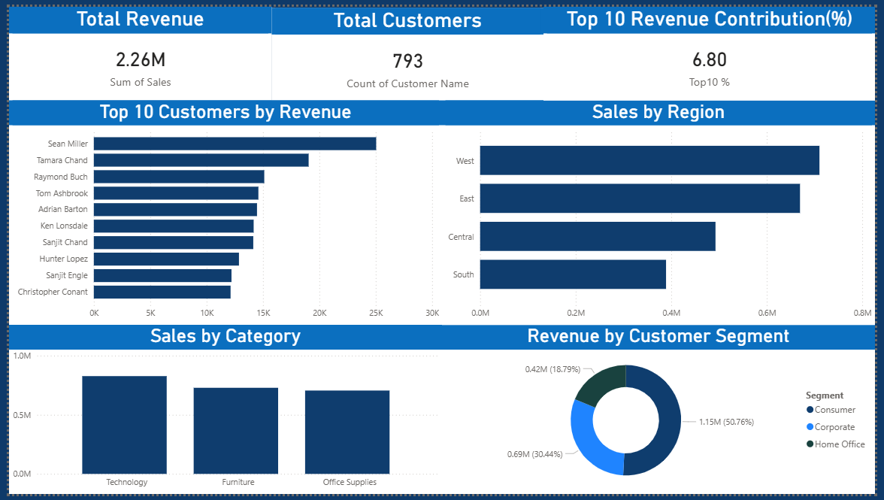

# Revenue Concentration Risk Dashboard

An interactive Power BI dashboard analyzing how revenue is distributed across customers, regions, product categories, and customer segments.

---

## Problem Statement

A business may generate high revenue, but reliance on a limited number of customers, regions, or product categories can introduce risk.

This project aims to identify such dependencies and highlight potential concentration risks.

---

## Objective

- Analyze total revenue and customer distribution  
- Identify top contributing customers  
- Examine revenue across regions and product categories  
- Understand contribution of customer segments  
- Highlight potential business risk  

---

## Dataset

- Source: Superstore Sales Dataset  
- Total Customers: 793  
- Key Columns:
  - Customer Name  
  - Sales  
  - Region  
  - Category  
  - Segment  

---

## Dashboard Preview

---

## Dashboard Features

### KPI Cards
- Total Revenue: 2.26M  
- Total Customers: 793  
- Top 10 Revenue Contribution: ~6.8%  

---

### Visuals

- Top 10 Customers by Revenue  
- Sales by Region  
- Sales by Category  
- Revenue by Customer Segment  

---

## Key Insights

- Revenue is distributed across multiple customers with moderate concentration  
- Certain regions contribute more significantly to total sales  
- Product categories show varied revenue contribution  
- Customer segments highlight different business drivers  

---

## Tech Stack

- Microsoft Power BI Desktop  
- Power Query  
- DAX  

---

## Project Structure
revenue-concentration-dashboard/
│
├── dataset.csv
├── dashboard.pbix
├── dashboard.png
└── README.md

---

## Conclusion

This dashboard provides a structured view of revenue distribution and helps identify potential dependency risks, supporting better business decisions.

---

## 📁 Project Structure
